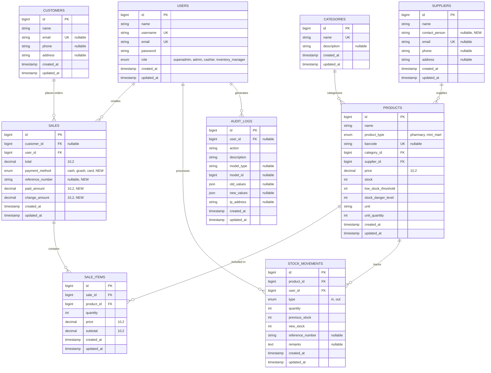

# iPharma Mart Management System - Entity Relationship Diagram

## Mermaid ERD (Copy and paste to mermaid.live)

## Alternative: Detailed ERD with Relationships

## Simplified Class Diagram Style

## Database Statistics

### Table Count: 9 Tables

1. users
2. customers
3. categories
4. suppliers
5. products
6. sales
7. sale_items
8. stock_movements
9. audit_logs

### Key Relationships

-   **1:N Relationships**: 9 relationships
-   **Polymorphic Relationship**: 1 (audit_logs with model_type/model_id)

### Recent Schema Changes (Nov 19, 2025)

1. ✅ Added `contact_person` to suppliers table
2. ✅ Added payment tracking fields to sales table:
    - `payment_method` (enum: cash, gcash, card)
    - `reference_number` (string, nullable)
    - `paid_amount` (decimal 10,2)
    - `change_amount` (decimal 10,2)

### Data Types Summary

-   **Primary Keys**: All BIGINT AUTO_INCREMENT
-   **Foreign Keys**: All BIGINT with cascade on delete
-   **Decimals**: price, total, subtotal (10,2 precision)
-   **Enums**: role, product_type, payment_method, type (stock movement), action (audit)
-   **JSON**: old_values, new_values (audit logs)
-   **Timestamps**: created_at, updated_at (all tables)

### Indexes

-   Primary Keys: All tables
-   Unique Indexes: username, email (users, customers, suppliers), barcode (products), name (categories)
-   Foreign Key Indexes: All FK columns automatically indexed
