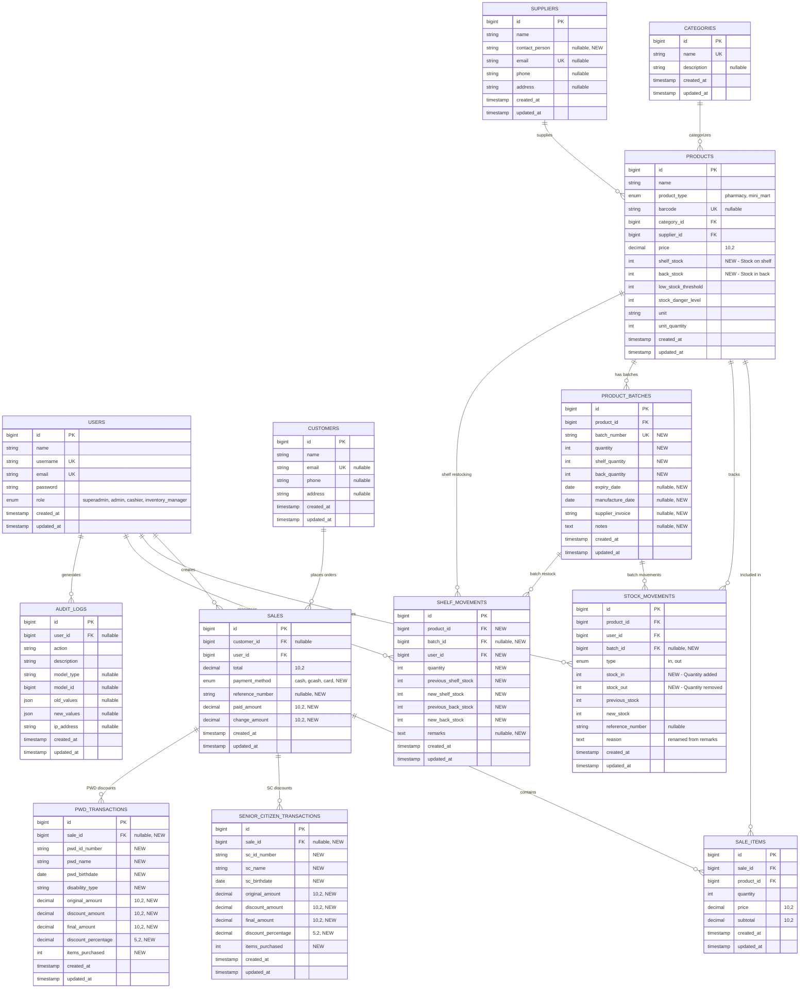
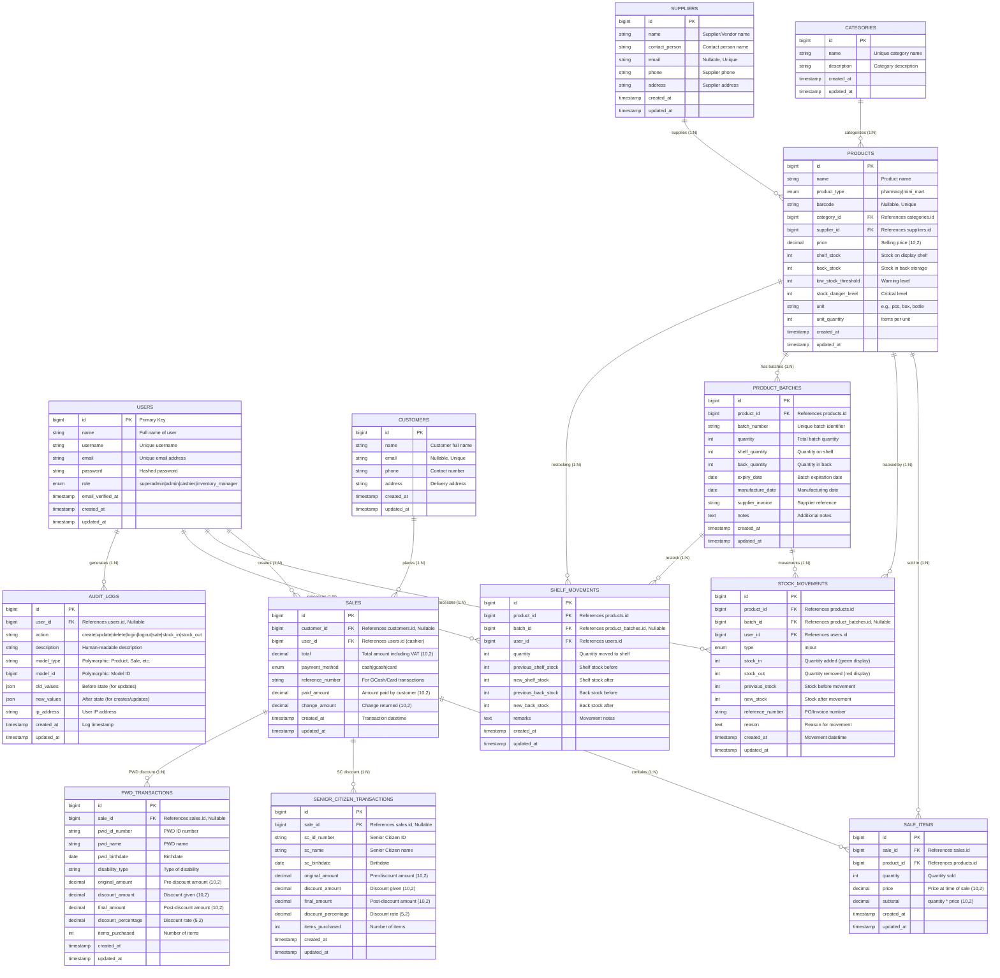
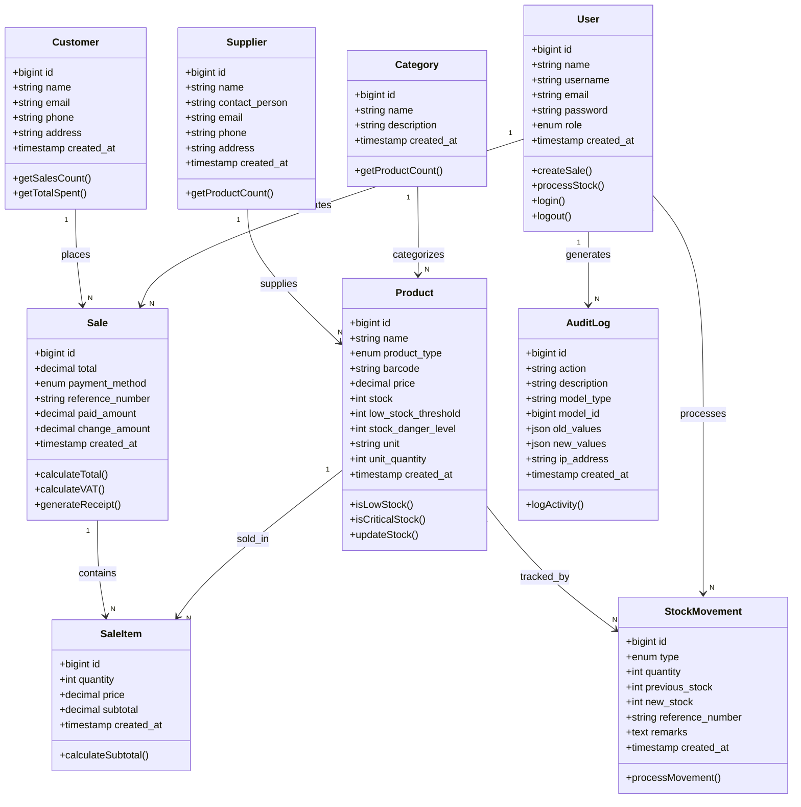

# iPharma Mart Management System - Entity Relationship Diagram

## Mermaid ERD (Copy and paste to mermaid.live)

## Alternative: Detailed ERD with Relationships

## Simplified Class Diagram Style

## Database Statistics

### Table Count: 13 Tables

1. users
2. customers
3. categories
4. suppliers
5. products
6. sales
7. sale_items
8. stock_movements
9. audit_logs
10. **product_batches** (NEW - Batch tracking with expiry dates)
11. **shelf_movements** (NEW - Shelf restocking history)
12. **senior_citizen_transactions** (NEW - SC discount compliance)
13. **pwd_transactions** (NEW - PWD discount compliance)

### Key Relationships

-   **1:N Relationships**: 17 relationships
    -   Users → Sales (cashier)
    -   Users → Stock Movements (processor)
    -   Users → Shelf Movements (processor)
    -   Users → Audit Logs (actor)
    -   Customers → Sales
    -   Categories → Products
    -   Suppliers → Products
    -   Products → Sale Items
    -   Products → Stock Movements
    -   Products → Product Batches
    -   Products → Shelf Movements
    -   Product Batches → Stock Movements
    -   Product Batches → Shelf Movements
    -   Sales → Sale Items
    -   Sales → Senior Citizen Transactions
    -   Sales → PWD Transactions
-   **Polymorphic Relationship**: 1 (audit_logs with model_type/model_id)

### Recent Schema Changes

#### November 26, 2025 - Inventory Batch Tracking & Stock Separation

1. ✅ **Products Table - Stock Management Restructure**:

    - Removed `stock` column (single stock count)
    - Removed `expiry_date` column (moved to batch level)
    - Added `shelf_stock` (integer, default 0) - Stock on display shelf
    - Added `back_stock` (integer, default 0) - Stock in back storage
    - **New computed attribute**: `total_stock = shelf_stock + back_stock`

2. ✅ **Created product_batches Table** - Batch-Level Expiry Tracking:

    - `id` (bigint, PK)
    - `product_id` (bigint, FK → products.id, cascade)
    - `batch_number` (string, unique) - Format: `BATCH-{UNIQID}`
    - `quantity` (integer) - Total batch quantity
    - `shelf_quantity` (integer, default 0) - Quantity on shelf
    - `back_quantity` (integer, default 0) - Quantity in back
    - `expiry_date` (date, nullable) - Batch expiration date
    - `manufacture_date` (date, nullable) - Manufacturing date
    - `supplier_invoice` (string, nullable) - Supplier reference
    - `notes` (text, nullable)
    - Timestamps: created_at, updated_at
    - **Relationships**: belongs to Product, has many StockMovements/ShelfMovements

3. ✅ **Created shelf_movements Table** - Shelf Restocking Tracking:

    - `id` (bigint, PK)
    - `product_id` (bigint, FK → products.id, cascade)
    - `batch_id` (bigint, FK → product_batches.id, nullable, cascade)
    - `user_id` (bigint, FK → users.id)
    - `quantity` (integer) - Quantity moved to shelf
    - `previous_shelf_stock` (integer) - Shelf stock before
    - `new_shelf_stock` (integer) - Shelf stock after
    - `previous_back_stock` (integer) - Back stock before
    - `new_back_stock` (integer) - Back stock after
    - `remarks` (text, nullable)
    - Timestamps: created_at, updated_at
    - **Relationships**: belongs to Product, Batch, User

4. ✅ **Stock_Movements Table - Restructured**:

    - Removed `quantity` column (replaced with separate in/out)
    - Renamed `remarks` to `reason`
    - Added `stock_in` (integer, default 0) - Stock added
    - Added `stock_out` (integer, default 0) - Stock removed
    - Added `batch_id` (bigint, FK → product_batches.id, nullable, cascade)
    - **Display Logic**: Green color for stock_in, Red color for stock_out
    - **FIFO**: Stock out operations deduct from oldest batches first

5. ✅ **Created senior_citizen_transactions Table** - Philippine SC Compliance:

    - `id` (bigint, PK)
    - `sale_id` (bigint, FK → sales.id, nullable, cascade)
    - `sc_id_number` (string) - Senior Citizen ID
    - `sc_name` (string) - Senior Citizen name
    - `sc_birthdate` (date) - Birthdate
    - `original_amount` (decimal 10,2) - Pre-discount amount
    - `discount_amount` (decimal 10,2) - Discount given
    - `final_amount` (decimal 10,2) - Post-discount amount
    - `discount_percentage` (decimal 5,2, default 20.00) - Discount rate
    - `items_purchased` (integer, default 0) - Item count
    - Timestamps: created_at, updated_at
    - **Purpose**: Separate audit trail for SC discounts per PH regulations

6. ✅ **Created pwd_transactions Table** - Philippine PWD Compliance:
    - `id` (bigint, PK)
    - `sale_id` (bigint, FK → sales.id, nullable, cascade)
    - `pwd_id_number` (string) - PWD ID
    - `pwd_name` (string) - PWD name
    - `pwd_birthdate` (date) - Birthdate
    - `disability_type` (string) - Type of disability
    - `original_amount` (decimal 10,2)
    - `discount_amount` (decimal 10,2)
    - `final_amount` (decimal 10,2)
    - `discount_percentage` (decimal 5,2, default 20.00)
    - `items_purchased` (integer, default 0)
    - Timestamps: created_at, updated_at
    - **Purpose**: Separate PWD discount records for compliance

#### November 19, 2025 - Payment Method Enhancement

1. ✅ Added `contact_person` to suppliers table
2. ✅ Added payment tracking fields to sales table:
    - `payment_method` (enum: cash, gcash, card)
    - `reference_number` (string, nullable)
    - `paid_amount` (decimal 10,2)
    - `change_amount` (decimal 10,2)

### Data Types Summary

-   **Primary Keys**: All BIGINT AUTO_INCREMENT
-   **Foreign Keys**: All BIGINT with cascade on delete
-   **Decimals**: price, total, subtotal (10,2 precision)
-   **Enums**: role, product_type, payment_method, type (stock movement), action (audit)
-   **JSON**: old_values, new_values (audit logs)
-   **Timestamps**: created_at, updated_at (all tables)

### Indexes

-   Primary Keys: All tables
-   Unique Indexes: username, email (users, customers, suppliers), barcode (products), name (categories)
-   Foreign Key Indexes: All FK columns automatically indexed
