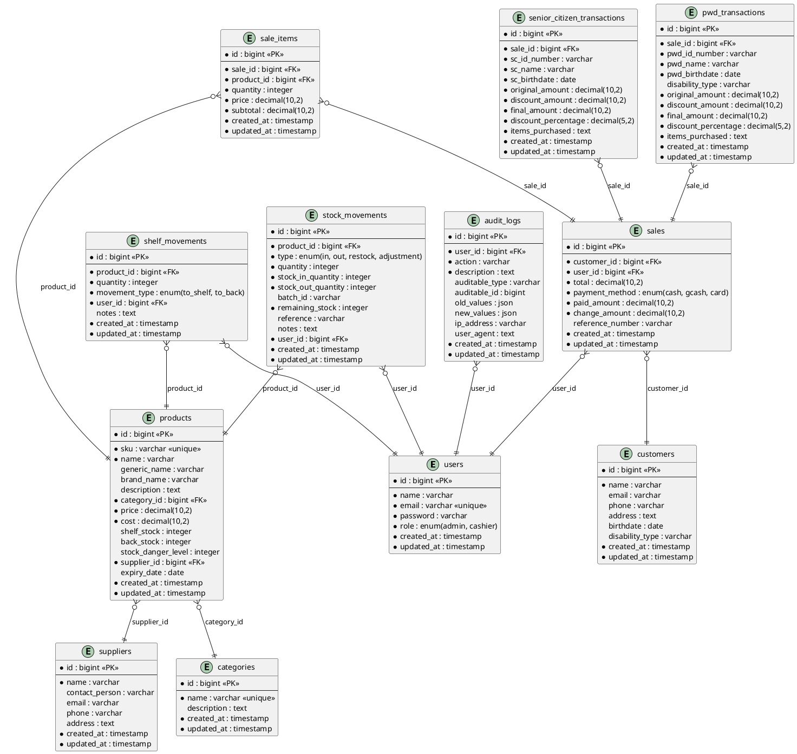
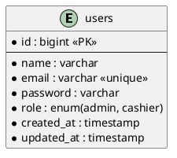
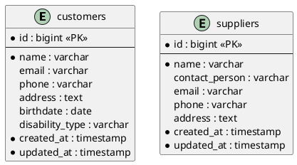
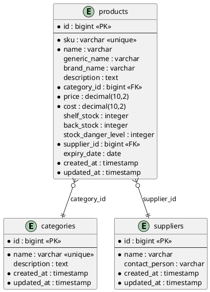
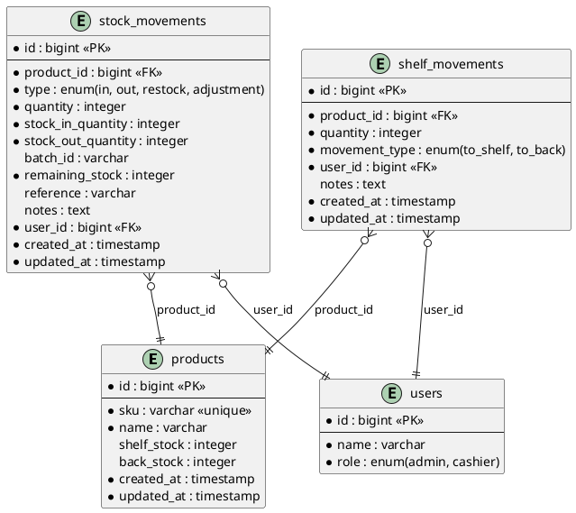
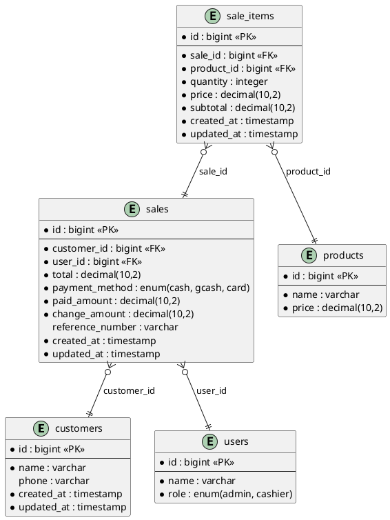
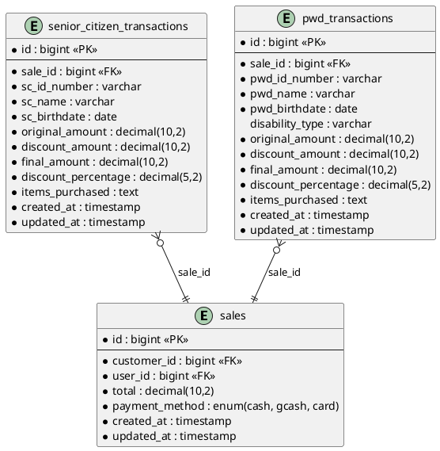
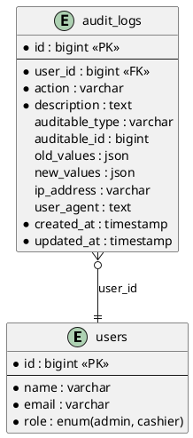

# Database ERD - iPharma Mart Management System

## Complete System ERD



---

## Module-Based ERDs

### 1. User Management Module



### 2. Customer & Supplier Module



### 3. Product & Inventory Module



### 4. Stock Management Module



### 5. Sales & POS Module



### 6. Discount Transaction Module



### 7. Audit & Logging Module



shelf_movements }o--|| products : product_id
shelf_movements }o--|| users : user_id
audit_logs }o--|| users : user_id

@enduml

```

```
