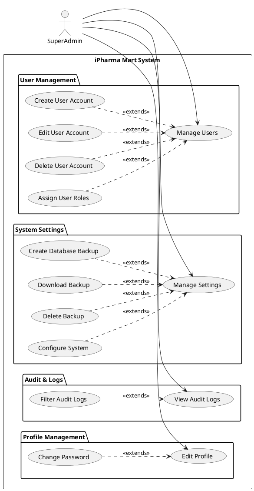
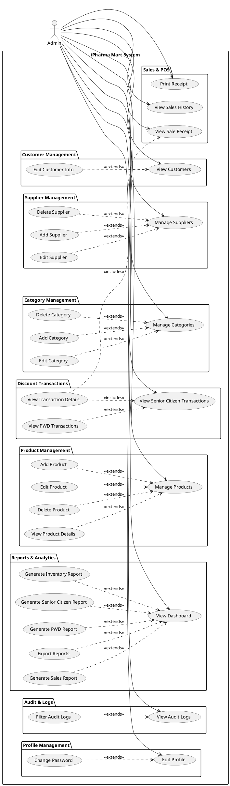
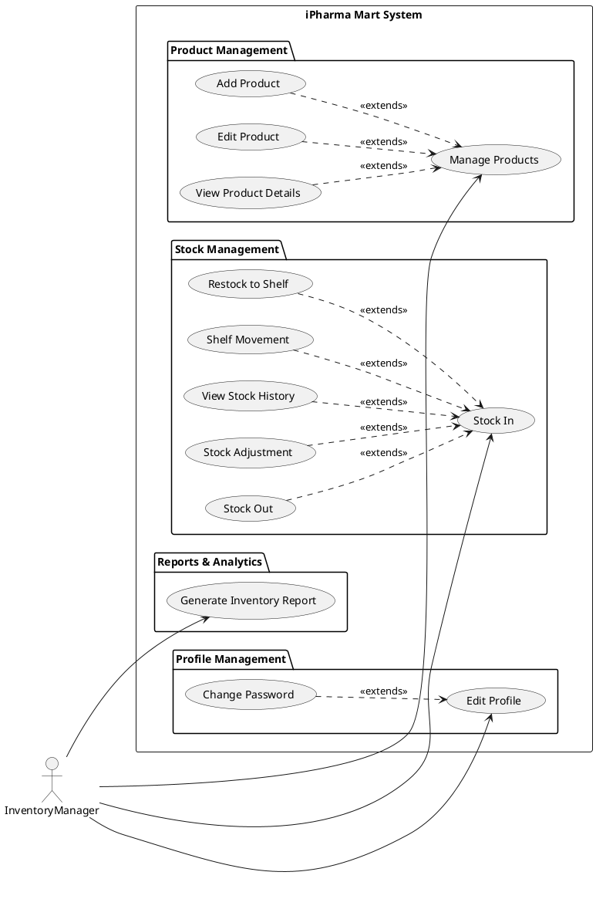
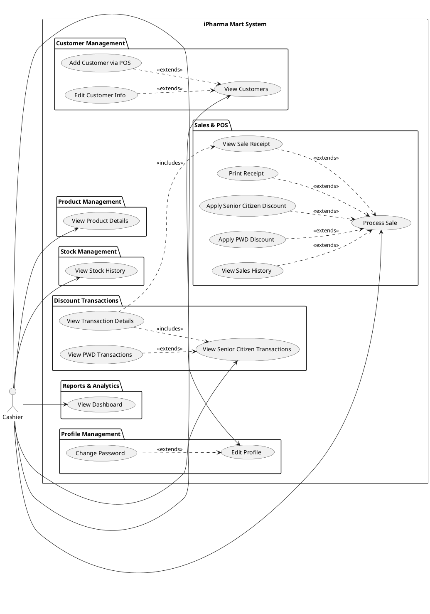

# Use Case Diagrams - iPharma Mart Management System

## SuperAdmin Use Case Diagram

```plantuml
@startuml SuperAdminUseCase

left to right direction

actor SuperAdmin as superadmin

rectangle "iPharma Mart System" {
  package "User Management" {
    usecase (Manage Users) as UC1
    usecase (Create User Account) as UC1A
    usecase (Edit User Account) as UC1B
    usecase (Delete User Account) as UC1C
    usecase (Assign User Roles) as UC1D
  }

  package "System Settings" {
    usecase (Manage Settings) as UC10
    usecase (Create Database Backup) as UC10A
    usecase (Download Backup) as UC10B
    usecase (Delete Backup) as UC10C
    usecase (Configure System) as UC10D
  }

  package "Audit & Logs" {
    usecase (View Audit Logs) as UC11
    usecase (Filter Audit Logs) as UC11A
  }

  package "Profile Management" {
    usecase (Edit Profile) as UC12
    usecase (Change Password) as UC12A
  }
}

superadmin --> UC1
superadmin --> UC10
superadmin --> UC11
superadmin --> UC12

UC1A ..> UC1 : <<extends>>
UC1B ..> UC1 : <<extends>>
UC1C ..> UC1 : <<extends>>
UC1D ..> UC1 : <<extends>>

UC10A ..> UC10 : <<extends>>
UC10B ..> UC10 : <<extends>>
UC10C ..> UC10 : <<extends>>
UC10D ..> UC10 : <<extends>>

UC11A ..> UC11 : <<extends>>

UC12A ..> UC12 : <<extends>>

@enduml
```

## Admin Use Case Diagram

```plantuml
@startuml AdminUseCase

left to right direction

actor Admin as admin

rectangle "iPharma Mart System" {
  package "Customer Management" {
    usecase (View Customers) as UC2
    usecase (Edit Customer Info) as UC2B
  }

  package "Supplier Management" {
    usecase (Manage Suppliers) as UC3
    usecase (Add Supplier) as UC3A
    usecase (Edit Supplier) as UC3B
    usecase (Delete Supplier) as UC3C
  }

  package "Category Management" {
    usecase (Manage Categories) as UC4
    usecase (Add Category) as UC4A
    usecase (Edit Category) as UC4B
    usecase (Delete Category) as UC4C
  }

  package "Product Management" {
    usecase (Manage Products) as UC5
    usecase (Add Product) as UC5A
    usecase (Edit Product) as UC5B
    usecase (Delete Product) as UC5C
    usecase (View Product Details) as UC5D
  }

  package "Sales & POS" {
    usecase (View Sales History) as UC7C
    usecase (View Sale Receipt) as UC7D
    usecase (Print Receipt) as UC7E
  }

  package "Discount Transactions" {
    usecase (View Senior Citizen Transactions) as UC8
    usecase (View PWD Transactions) as UC8A
    usecase (View Transaction Details) as UC8B
  }

  package "Reports & Analytics" {
    usecase (View Dashboard) as UC9
    usecase (Generate Sales Report) as UC9A
    usecase (Generate Inventory Report) as UC9B
    usecase (Generate Senior Citizen Report) as UC9C
    usecase (Generate PWD Report) as UC9D
    usecase (Export Reports) as UC9E
  }

  package "Audit & Logs" {
    usecase (View Audit Logs) as UC11
    usecase (Filter Audit Logs) as UC11A
  }

  package "Profile Management" {
    usecase (Edit Profile) as UC12
    usecase (Change Password) as UC12A
  }
}

admin --> UC2
admin --> UC3
admin --> UC4
admin --> UC5
admin --> UC7C
admin --> UC7D
admin --> UC7E
admin --> UC8
admin --> UC9
admin --> UC11
admin --> UC12

UC2B ..> UC2 : <<extends>>

UC3A ..> UC3 : <<extends>>
UC3B ..> UC3 : <<extends>>
UC3C ..> UC3 : <<extends>>

UC4A ..> UC4 : <<extends>>
UC4B ..> UC4 : <<extends>>
UC4C ..> UC4 : <<extends>>

UC5A ..> UC5 : <<extends>>
UC5B ..> UC5 : <<extends>>
UC5C ..> UC5 : <<extends>>
UC5D ..> UC5 : <<extends>>

UC8A ..> UC8 : <<extends>>
UC8B ..> UC8 : <<includes>>
UC8B ..> UC7D : <<includes>>

UC9A ..> UC9 : <<extends>>
UC9B ..> UC9 : <<extends>>
UC9C ..> UC9 : <<extends>>
UC9D ..> UC9 : <<extends>>
UC9E ..> UC9 : <<extends>>

UC11A ..> UC11 : <<extends>>

UC12A ..> UC12 : <<extends>>

@enduml
```

## Inventory Manager Use Case Diagram

```plantuml
@startuml InventoryManagerUseCase

left to right direction

actor InventoryManager as inventory

rectangle "iPharma Mart System" {
  package "Product Management" {
    usecase (Manage Products) as UC5
    usecase (Add Product) as UC5A
    usecase (Edit Product) as UC5B
    usecase (View Product Details) as UC5D
  }

  package "Stock Management" {
    usecase (Stock In) as UC6
    usecase (Stock Out) as UC6A
    usecase (Restock to Shelf) as UC6B
    usecase (Shelf Movement) as UC6C
    usecase (View Stock History) as UC6D
    usecase (Stock Adjustment) as UC6E
  }

  package "Reports & Analytics" {
    usecase (Generate Inventory Report) as UC9B
  }

  package "Profile Management" {
    usecase (Edit Profile) as UC12
    usecase (Change Password) as UC12A
  }
}

inventory --> UC5
inventory --> UC6
inventory --> UC9B
inventory --> UC12

UC5A ..> UC5 : <<extends>>
UC5B ..> UC5 : <<extends>>
UC5D ..> UC5 : <<extends>>

UC6A ..> UC6 : <<extends>>
UC6B ..> UC6 : <<extends>>
UC6C ..> UC6 : <<extends>>
UC6D ..> UC6 : <<extends>>
UC6E ..> UC6 : <<extends>>

UC12A ..> UC12 : <<extends>>

@enduml
```

## Cashier Use Case Diagram

```plantuml
@startuml CashierUseCase

left to right direction

actor Cashier as cashier

rectangle "iPharma Mart System" {
  package "Customer Management" {
    usecase (View Customers) as UC2
    usecase (Add Customer via POS) as UC2A
    usecase (Edit Customer Info) as UC2B
  }

  package "Product Management" {
    usecase (View Product Details) as UC5D
  }

  package "Stock Management" {
    usecase (View Stock History) as UC6D
  }

  package "Sales & POS" {
    usecase (Process Sale) as UC7
    usecase (Apply Senior Citizen Discount) as UC7A
    usecase (Apply PWD Discount) as UC7B
    usecase (View Sales History) as UC7C
    usecase (View Sale Receipt) as UC7D
    usecase (Print Receipt) as UC7E
  }

  package "Discount Transactions" {
    usecase (View Senior Citizen Transactions) as UC8
    usecase (View PWD Transactions) as UC8A
    usecase (View Transaction Details) as UC8B
  }

  package "Reports & Analytics" {
    usecase (View Dashboard) as UC9
  }

  package "Profile Management" {
    usecase (Edit Profile) as UC12
    usecase (Change Password) as UC12A
  }
}

cashier --> UC2
cashier --> UC5D
cashier --> UC6D
cashier --> UC7
cashier --> UC8
cashier --> UC9
cashier --> UC12

UC2A ..> UC2 : <<extends>>
UC2B ..> UC2 : <<extends>>

UC7A ..> UC7 : <<extends>>
UC7B ..> UC7 : <<extends>>
UC7C ..> UC7 : <<extends>>
UC7D ..> UC7 : <<extends>>
UC7E ..> UC7 : <<extends>>

UC8A ..> UC8 : <<extends>>
UC8B ..> UC8 : <<includes>>
UC8B ..> UC7D : <<includes>>

UC12A ..> UC12 : <<extends>>

@enduml
```
