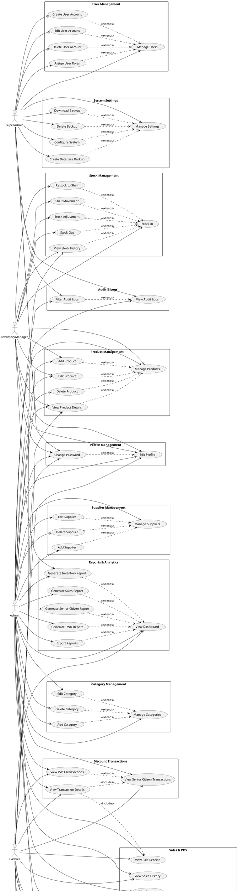

# Use Case Diagram - iPharma Mart Management System

```plantuml
@startuml UseCaseDiagram

left to right direction
skinparam packageStyle rectangle

actor SuperAdmin as superadmin
actor Admin as admin
actor InventoryManager as inventory
actor Cashier as cashier

package "User Management" {
  usecase (Manage Users) as UC1
  usecase (Create User Account) as UC1A
  usecase (Edit User Account) as UC1B
  usecase (Delete User Account) as UC1C
  usecase (Assign User Roles) as UC1D
}

package "Customer Management" {
  usecase (View Customers) as UC2
  usecase (Add Customer via POS) as UC2A
  usecase (Edit Customer Info) as UC2B
}

package "Supplier Management" {
  usecase (Manage Suppliers) as UC3
  usecase (Add Supplier) as UC3A
  usecase (Edit Supplier) as UC3B
  usecase (Delete Supplier) as UC3C
}

package "Category Management" {
  usecase (Manage Categories) as UC4
  usecase (Add Category) as UC4A
  usecase (Edit Category) as UC4B
  usecase (Delete Category) as UC4C
}

package "Product Management" {
  usecase (Manage Products) as UC5
  usecase (Add Product) as UC5A
  usecase (Edit Product) as UC5B
  usecase (Delete Product) as UC5C
  usecase (View Product Details) as UC5D
}

package "Stock Management" {
  usecase (Stock In) as UC6
  usecase (Stock Out) as UC6A
  usecase (Restock to Shelf) as UC6B
  usecase (Shelf Movement) as UC6C
  usecase (View Stock History) as UC6D
  usecase (Stock Adjustment) as UC6E
}

package "Sales & POS" {
  usecase (Process Sale) as UC7
  usecase (Apply Senior Citizen Discount) as UC7A
  usecase (Apply PWD Discount) as UC7B
  usecase (View Sales History) as UC7C
  usecase (View Sale Receipt) as UC7D
  usecase (Print Receipt) as UC7E
}

package "Discount Transactions" {
  usecase (View Senior Citizen Transactions) as UC8
  usecase (View PWD Transactions) as UC8A
  usecase (View Transaction Details) as UC8B
}

package "Reports & Analytics" {
  usecase (View Dashboard) as UC9
  usecase (Generate Sales Report) as UC9A
  usecase (Generate Inventory Report) as UC9B
  usecase (Generate Senior Citizen Report) as UC9C
  usecase (Generate PWD Report) as UC9D
  usecase (Export Reports) as UC9E
}

package "System Settings" {
  usecase (Manage Settings) as UC10
  usecase (Create Database Backup) as UC10A
  usecase (Download Backup) as UC10B
  usecase (Delete Backup) as UC10C
  usecase (Configure System) as UC10D
}

package "Audit & Logs" {
  usecase (View Audit Logs) as UC11
  usecase (Filter Audit Logs) as UC11A
}

package "Profile Management" {
  usecase (Edit Profile) as UC12
  usecase (Change Password) as UC12A
}

superadmin --> UC1
superadmin --> UC1A
superadmin --> UC1B
superadmin --> UC1C
superadmin --> UC1D
superadmin --> UC10
superadmin --> UC10A
superadmin --> UC10B
superadmin --> UC10C
superadmin --> UC10D
superadmin --> UC11
superadmin --> UC11A

admin --> UC2
admin --> UC2B
admin --> UC3
admin --> UC3A
admin --> UC3B
admin --> UC3C
admin --> UC4
admin --> UC4A
admin --> UC4B
admin --> UC4C
admin --> UC5
admin --> UC5A
admin --> UC5B
admin --> UC5C
admin --> UC5D
admin --> UC7C
admin --> UC7D
admin --> UC7E
admin --> UC8
admin --> UC8A
admin --> UC8B
admin --> UC9
admin --> UC9A
admin --> UC9B
admin --> UC9C
admin --> UC9D
admin --> UC9E
admin --> UC11
admin --> UC11A

inventory --> UC5
inventory --> UC5A
inventory --> UC5B
inventory --> UC5D
inventory --> UC6
inventory --> UC6A
inventory --> UC6B
inventory --> UC6C
inventory --> UC6D
inventory --> UC6E
inventory --> UC9B

cashier --> UC2
cashier --> UC2A
cashier --> UC2B
cashier --> UC5D
cashier --> UC6D
cashier --> UC7
cashier --> UC7A
cashier --> UC7B
cashier --> UC7C
cashier --> UC7D
cashier --> UC7E
cashier --> UC8
cashier --> UC8A
cashier --> UC8B
cashier --> UC9

superadmin --> UC12
superadmin --> UC12A
admin --> UC12
admin --> UC12A
inventory --> UC12
inventory --> UC12A
cashier --> UC12
cashier --> UC12A

UC1A ..> UC1 : <<extends>>
UC1B ..> UC1 : <<extends>>
UC1C ..> UC1 : <<extends>>
UC1D ..> UC1 : <<extends>>

UC2A ..> UC2 : <<extends>>
UC2B ..> UC2 : <<extends>>

UC3A ..> UC3 : <<extends>>
UC3B ..> UC3 : <<extends>>
UC3C ..> UC3 : <<extends>>

UC4A ..> UC4 : <<extends>>
UC4B ..> UC4 : <<extends>>
UC4C ..> UC4 : <<extends>>

UC5A ..> UC5 : <<extends>>
UC5B ..> UC5 : <<extends>>
UC5C ..> UC5 : <<extends>>
UC5D ..> UC5 : <<extends>>

UC6A ..> UC6 : <<extends>>
UC6B ..> UC6 : <<extends>>
UC6C ..> UC6 : <<extends>>
UC6D ..> UC6 : <<extends>>
UC6E ..> UC6 : <<extends>>

UC7A ..> UC7 : <<extends>>
UC7B ..> UC7 : <<extends>>
UC7E ..> UC7 : <<extends>>

UC8A ..> UC8 : <<extends>>
UC8B ..> UC8 : <<includes>>
UC8B ..> UC7D : <<includes>>

UC9A ..> UC9 : <<extends>>
UC9B ..> UC9 : <<extends>>
UC9C ..> UC9 : <<extends>>
UC9D ..> UC9 : <<extends>>
UC9E ..> UC9 : <<extends>>

UC10A ..> UC10 : <<extends>>
UC10B ..> UC10 : <<extends>>
UC10C ..> UC10 : <<extends>>
UC10D ..> UC10 : <<extends>>

UC11A ..> UC11 : <<extends>>

UC12A ..> UC12 : <<extends>>

@enduml
```
